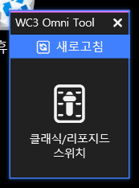
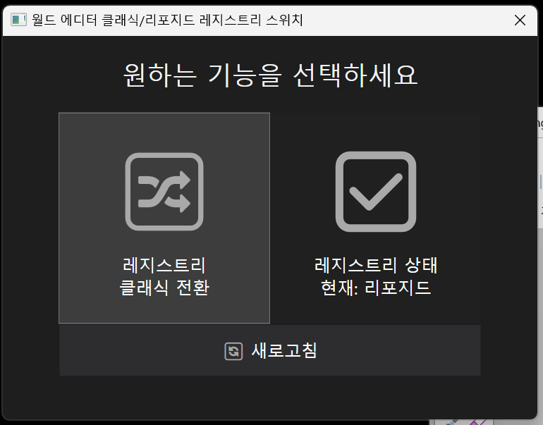
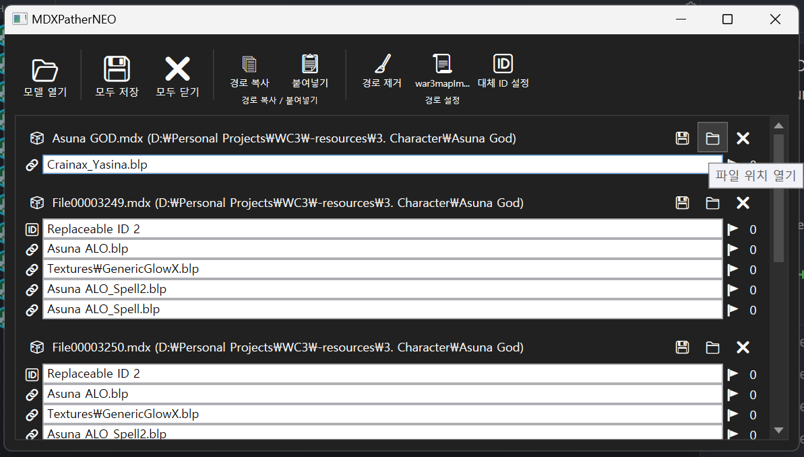

# wc3-omni-tools

워크래프트3 커스텀 지도 제작을 위한 다양한 도구들을 제공합니다.


## WC3OmniTool

| 미리 보기 |
| -- |
|  |

- 메인 프로그램
- `\tools` 하위 디렉토리에 위치한 도구들을 실행할 수 있습니다.
- `omni.json` 파일을 스캔하여 실행 가능한 도구들을 등록합니다.

```json
{
  "Icon": "🎚️",
  "ButtonText": "클래식/리포지드\n스위치",
  "MenuText": "클래식/리포지드 스위치",
  "Executable": "ClassicReforgedEditorSwitch.exe"
}
```


## ClassicReforgedEditorSwitch

| 미리 보기 |
| -- |
|  |

- 레지스트리를 전환하여 클래식/리포지드 에디터를 실행할 수 있게 합니다.
- 리포지드 에디터를 한번이라도 실행하면 샤프크래프트 에디터를 실행할 수 없게 되는 문제를 해결합니다.
- 원하는 에디터를 실행하기 전에 이 프로그램을 실행해서 레지스트리를 전환해주세요.


## MDXPatherNEO

| 미리 보기 |
| -- |
|  |

- MDX 파일 내부의 텍스처 경로를 변경합니다.
- 파일 경로로 설정하거나, Replaceable ID 로 설정할 수 있습니다.
- 탐색기에서 모델 파일을 끌어다 놓는 방법으로도 열 수 있습니다.
- 단축키 및 기능 설명은 각 버튼과 항목에 마우스를 올려놓는 행위로 확인할 수 있습니다.
- 키보드 위/아래 방향키를 통해 이전/다음 텍스처를 빠르게 수정할 수 있습니다.

